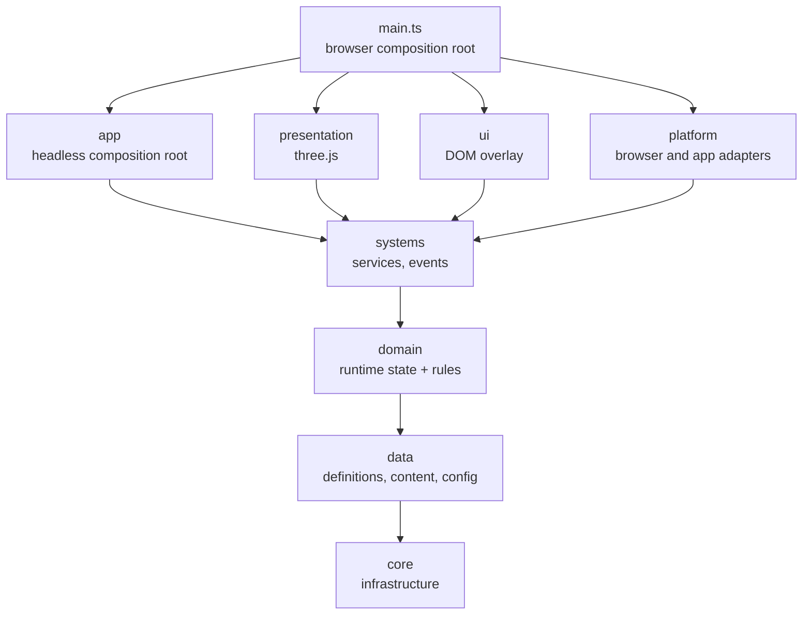

# RoadHaul Architecture

This document explains how the code is organised and why. The rules it describes are enforced by the type checker and by tests; `CLAUDE.md` has the short version.

## 1. Goals

- **Mobile first.** Runs in Android browsers and in a Capacitor-wrapped Android app, at 30 FPS or more on low/mid devices (spec §5).
- **Playable core before content** (spec §2.2). The code must grow by adding data, not by rewriting systems.
- **Game rules run without a browser.** They are unit-testable in Node and reusable on a server if the game goes online (spec §66).
- **Every change is verifiable** by typecheck, tests, build and a real-browser smoke test, in CI and in Claude Code sessions.

Stack: TypeScript, three.js (WebGL2), Vite, Vitest and Playwright ([ADR 0001](docs/adr/0001-web-stack-typescript-threejs.md)). Vehicle physics is our own deterministic model rather than a physics engine ([ADR 0002](docs/adr/0002-custom-vehicle-model.md)). Capacitor wraps the same build into the Android app (§16).

## 2. Layers

The spec's principle is **Data -> Domain -> Systems -> Presentation -> UI**. Each layer only depends on the layers before it:



| Layer | Folder | Holds | May import | Runs on |
|---|---|---|---|---|
| core | `src/core` | Engine-agnostic infrastructure: service container, event bus, logging, clock, game loop, validation, `Result` | nothing | anywhere |
| data | `src/data` | Static definitions (the spec's ScriptableObjects), built-in content, central config | core | anywhere |
| domain | `src/domain` | Runtime state and pure rules: truck dynamics, road geometry and guidance, surfaces and collisions, mission rules (bays, stages, cargo damage, pay, XP), the wallet and costs, fuel and damage formulas, company levels, save data with migrations and validation, company name rules | core, data | anywhere |
| systems | `src/systems` | Services that own runtime state, apply domain rules and publish `GameEvents` (game state, driving, missions, economy, fuel, damage, company, saves, the game session) | core, data, domain | anywhere |
| app | `src/app` | Headless composition root: `GameBootstrapper`, `ServiceKeys` | core … systems | anywhere |
| presentation | `src/presentation` | three.js renderer, environment, track, depot and truck views, cameras, visual effects; the sound (Web Audio) | core … systems, `three` | browser |
| ui | `src/ui` | DOM overlay: main menu, the company panel over the road (job board, truck, garage, events) and the buttons that open it, mission HUD, touch driving controls, pause and result screens, string tables, debug overlay, styles | core … systems | browser |
| platform | `src/platform` | Browser/device adapters: frame scheduler, keyboard input, URL flags, fatal error screen, localStorage, the device's graphics preset and settings; the Android app's back button and lifecycle | core … systems, `@capacitor/app` | browser, Android app |
| entry | `src/main.ts` | Browser composition root | everything | browser |

"Anywhere" means browser, Node (tests) or a future server.

### Enforcement

1. **`tsconfig.pure.json`** compiles `core`, `data`, `domain`, `systems` and `app` with only the ES2022 library and no DOM or Node typings. Using `window`, `document`, `console`, `setTimeout` or `performance` there is a compile error.
2. **`tests/architecture/layering.test.ts`** scans the imports of every source file in `src/`. That covers static, type-only, re-export, dynamic and `import.meta.glob` imports, in `.ts`, `.mts`, `.cts` and `.tsx` files. The test fails when a layer imports a layer or npm package it may not use; it is what keeps three.js out of the pure layers. This is the spec §55 dependency rule turned into a test. The scanner itself is tested in `tests/architecture/importSpecifiers.test.ts`.

## 3. Core rules

- **UI and presentation never change game state directly** (spec §7). They call a system method, for example `economyService.addMoney(reward)`, never `money += 5000`, and they observe `GameEvents` to redraw.
- **Definitions are immutable, runtime state is separate** (spec §54). `ContentCatalog` deep-freezes every definition. Runtime state lives in the domain/systems layers and stores definition ids, never definition objects.
- **No global mutable state.** There are no singletons or module-level variables that change. Services are created in a composition root and passed as constructor parameters.
- **Inject the outside world.** Time (`Clock`), frame timing (`FrameScheduler`), logging (`Logger`) and later storage and randomness are interfaces, so rules are deterministic under test.
- **Expected failures vs bugs.** Invalid player input returns a `Result` (see `validateCompanyName`). Broken invariants throw (see `GameStateService.transitionTo`).

## 4. Boot sequence

1. `src/main.ts` picks the graphics preset (`?quality=`, the saved setting or the device) and reads URL flags (`?debug`, `?log=`, `?fuelScale=`, `?traffic=`, `?weather=`) into the config, picks the clock (`?date=` moves its calendar, for the special events and the contracts of the day) and creates a `ConsoleLogger`.
2. `GameBootstrapper.boot()`:
   1. registers `Logger` and `Clock`;
   2. validates the content and builds the `ContentCatalog` (all problems are reported together);
   3. validates the config against the content (for example, that the starting truck exists);
   4. creates the `EventBus` and the services in dependency order: game state, driving, traffic, weather, economy, company, missions, navigation, damage, fuel, the garage and the upgrade shop, special events, the tutorial, saves and the game session (which subscribes last, so it saves state the others have already updated);
   5. runs `initialize()` on every service in registration order;
   6. moves the game state from `booting` to `mainMenu`.
3. `src/main.ts` picks the language (`?lang=`, then the browser's), puts the starting truck at the start of the starting map, and creates the `RenderHost` (WebGL), `EnvironmentView`, `TrackView`, `DepotView`, `RestAreaView`, `TrafficView`, `GpsRouteView`, `RainView`, `TruckView`, `CameraRig`, keyboard and touch input, the menus, the HUD and, with `?debug`, the performance overlay. It wires the game flow (section 8) and starts the `GameLoop`. The game waits in the main menu, which offers Continue (with a saved game) and New company.
4. `<html data-boot-state>` becomes `ready`. `data-game-state` follows every `GameStateChanged` event, `data-panel` whether the company panel is open, `data-mission-state` every `MissionStateChanged`, `data-vehicle` the truck being driven, `data-truck-view` what the truck on screen is built from (model, paint, upgraded parts), `data-traffic` the vehicles on the road and `data-weather` every `WeatherChanged`. The e2e tests wait for them.

Any failure shows the fatal error screen and sets `data-boot-state="error"`. A failed boot disposes every service it had already created.

## 5. Services and lifecycle

`ServiceContainer` (`src/core/services`) is a typed registry with an ordered lifecycle:

- `register(key, instance)` / `resolve(key)` with typed `ServiceKey`s (`src/app/ServiceKeys.ts`);
- `initializeAll()` calls `initialize()` (sync or async) in registration order;
- `disposeAll()` calls `dispose()` in reverse order, keeps going when one fails, and rethrows all failures together.

Only composition code (`src/app`, `src/main.ts`) calls `resolve`. Everything else gets its dependencies through its constructor. The container is not a service locator.

**Adding a service:** write the class with constructor dependencies, register it in `GameBootstrapper.boot()` after its dependencies, add its key to `ServiceKeys`, and list it in `SYSTEM_MAP.md`.

## 6. Events

`EventBus<GameEvents>` (`src/core/events`) is a synchronous, typed publish/subscribe channel (spec §57). All cross-system events are declared in one map, `src/systems/GameEvents.ts`. Today it holds:

- game flow and driving: `GameStateChanged`, `VehicleCollided`;
- missions: `MissionStateChanged`, `CargoDamaged`, `MissionCompleted`, `MissionFailed`;
- money and the truck: `MoneyChanged`, `FuelChanged`, `Refuelled`, `VehicleDamaged`, `VehicleRepaired`;
- the garage: `VehiclePurchased`, `ActiveVehicleChanged`, `UpgradePurchased`;
- the company: `CompanyProgressed`, `CompanyLevelUp`;
- the weather: `WeatherChanged`;
- special events: `EventProgressed`;
- the tutorial: `TutorialStepChanged`.

Events join as their systems arrive.

- Systems emit. Presentation and UI subscribe.
- Events emitted by a handler are queued and delivered right after the current event, so every handler sees events in the order they happened. Otherwise delivery is synchronous.
- Unsubscribing takes effect immediately, even for the event being delivered. A disposed view never receives another event.
- `emit` does not allocate, except when it queues an event raised by a handler.
- A throwing handler is logged and does not break delivery to the others.

## 7. Game loop and time

`GameLoop` (`src/core/time`) is driven by a `FrameScheduler`, which is `requestAnimationFrame` in the browser and a fake in tests:

- `fixedUpdate(step)` runs at a fixed **60 Hz** (`FixedTimestep`), 0 to 5 times per frame. Physics and game rules go here, so they behave the same at any frame rate.
- `frameUpdate(delta, alpha)` runs once per frame. Animation and rendering go here. `alpha` interpolates visuals between fixed steps.
- Frames longer than 0.25 s (tab switches, hitches) are clamped. At most 5 catch-up steps run per frame, so a slow phone slows the simulation down instead of spiralling.
- The browser stops animation frames in background tabs, so the game pauses automatically.
- A handler that throws stops the loop and shows the fatal error screen.

The values live in `GameConfig.simulation`.

## 8. Driving and the mission loop

### Driving

Driving runs through the layers like everything else (roadmap steps 04–08):

```text
keyboard (platform/input) ─┐
touch controls (ui) ───────┼─ combineVehicleInputs ─► DrivingService.step(dt, input)   [fixedUpdate, 60 Hz]
tilt (platform/input) ─────┘                              │
                                        VehicleDynamics ──┤  domain: speed, gear, steering, position
                                        DrivingWorld ─────┘  domain: surface under the truck, collisions
                                                          │
                     TruckView, CameraRig ◄── interpolated pose (previous → current, alpha)   [frameUpdate]
```

- **`VehicleDynamics`** (`src/domain/vehicles`) is a deterministic kinematic bicycle model referenced at the rear axle ([ADR 0002](docs/adr/0002-custom-vehicle-model.md)). Its drivetrain has:
  - a torque/power curve and an automatic gearbox (it cannot hunt between gears);
  - a speed governor;
  - drag, rolling resistance and engine braking;
  - grip-limited traction and braking;
  - reverse, two ways (`VehicleInput.lever`): on `auto` (the keyboard) hold the brake at a standstill to reverse; with the touch controls' D/R button (`drive`/`reverse`) the gas pedal drives the way the lever points, the brake only brakes, and the gearbox follows the lever at a standstill;
  - understeer at the truck's cornering limit (`maxLateralAccelerationG`, 0.52–0.62 g: a junction at 30 km/h fits a 14 m radius).

  All of it is data in `VehicleDefinition`. `vehicleTuning.test.ts` keeps the shipped trucks feeling like trucks.
- **`DrivingWorld`** (`src/domain/world`) is built from a `MapDefinition`:
  - road centrelines, sampled from a Catmull-Rom curve (`RoadPath`), each of a spec §20 kind (street, ring road, highway, country road);
  - the road network (`RoadNetwork`): roads meet where they share a control point, and routes follow the roads across those junctions;
  - asphalt (roads, turning circles at dead ends, depot yards, rest area lots) or grass under the truck;
  - service points: the depot yards and rest area lots, the only places with a pump and a workshop;
  - trees scattered from a seed, kept clear of roads, yards, lots and buildings;
  - street lamps along the town roads (streets and ring roads, where the map sets a spacing), on alternating sides, clear of junctions, yards, lots and other roads;
  - the cities' name boards where roads enter them (`MapDefinition.citySigns`: a road, a distance along it, and the direction of the traffic they greet);
  - farm fields, each given as a stretch of road, a side, a setback and a depth, and set back from wherever the road bulges toward it; seeded hay bales in rows on the harvested ones;
  - wind turbines;
  - guard rails on the outside of the sharp bends out of town (`guardRails.ts`): wherever a ring road, highway or country road turns tighter than a 300 m radius through at least 25°, a rail runs 1.2 m beyond the asphalt on posts 2.5 m apart, on 15 m past the bend either way, broken off at junctions, yards, lots, turning circles, other roads, buildings and the water, and left out where under 30 m. On the shipped region they line the ring road's four corners;
  - the sea along the west edge (`MapDefinition.sea`): water west of a shoreline that runs from the map's north edge to its south edge, so there is one shore at any z; paved quays along it, boats moored off it, cranes on the quays, and seeded boulders along the natural shore. The shore is a wall the truck stops at (like the map edge, a line: each stretch of shoreline pushes the footprint's circles back onto the land). Quays drive like yards; trees keep clear of the shore and the quays, lamps of the water;
  - buildings and the map edge.

  Tree trunks, lamp posts, the boards' posts, hay bales, turbine towers and the cranes' legs are solid circles, filed by 20 m grid cell like the road pieces. Guard rails are walls: each piece between two posts is a line 0.2 m thick either side with rounded ends, filed by grid cell too. At the fixed step the truck moves at most about half a meter, less than a footprint circle's radius, so it cannot pass through one. Fields drive like grass.

  Collisions correct the position per contact, then respond once per step to the hardest contact. A head-on hit stops the truck. A glancing one (under 20°) turns it along the obstacle, so it slides on with the speed it had along the surface instead of sticking. Angles up to 45° blend the two. Traffic counts too (moving obstacles): the truck takes an impact only when it drives into a vehicle, and one it rear-ends carries it along at its speed.
- **`DrivingService`** (`src/systems/driving`) owns the truck being driven. It emits one `VehicleCollided` per crash: impacts of 1.5 m/s or more into an obstacle, not repeated while the truck stays in contact. It also sets the cargo mass (a loaded truck is slower), parks the truck at a pose, and recovers a stuck truck into the right-hand lane of the nearest road. Presentation reads its state and never writes it.
- **Input** is device-independent (`VehicleInput`). Keyboard (arrows/WASD, Space, C), touch controls (gas, brake, the D/R gear button, camera button, and the steering wheel, which reaches full lock at a quarter turn, or left/right buttons) and tilt steering are merged every fixed step: steering adds up, pedals take the stronger press, and the gear lever is the one of the device being pressed (`combineVehicleInputs`). A drive starts in D.
- **Tilt steering** turns the phone into the steering wheel. `TiltSteering` (pure, unit-tested) measures how far the phone has turned about the screen's axis since it was calibrated, from the accelerometer's gravity: straight ahead is how the phone is held at the start of a drive, when the screen turns and when the tilt button is tapped. Only the angle between two readings counts, so it works in any screen orientation and with browsers that report gravity with the opposite sign. Tipped back far, the angle is read against half of gravity, so it stays steady down to a phone held flat. `TiltInput` (platform) feeds it from `devicemotion` only while tilt is the picked way of steering, and asks iOS for the sensor from a tap. The way of steering, tilt sensitivity and control size are device settings, like the graphics preset.

### Cameras

`CameraRig` (presentation) places the camera for the mode picked: chase, cabin, hood, rear or top (spec §31), from the truck's interpolated pose and motion, allocation-free. The cameras looking ahead widen their view by up to 6° between 30 and 90 km/h, eased, so the road seems to rush past. Where the cab's parts are comes from `cabGeometry`, shared with `TruckView`, so the driver's eye sits behind the steering wheel the truck model draws. The player's drag (`LookAround`, DOM-free) turns any camera within its limits. The rear camera's picture is mirrored by flipping the canvas (`RenderHost.mirrored`), not the projection, so face culling is untouched.

### The 2D maps

The minimap and the full-screen map draw the same `MapSketch`: the world's roads simplified (Ramer–Douglas–Peucker, 1.5 m) and cut into runs of up to 32 points, each with its bounds, plus yards, lots, turning circles, buildings, depots, rest areas and where city names go. `MapPainter` turns each run into a `Path2D` once and strokes only the runs a `MapViewport` sees, under the canvas transform, so a repaint allocates nothing. The viewport is DOM-free and unit-tested: north up for the full map, the truck's heading up for the minimap. The full map repaints only after a pan, zoom or resize, and the entry point pauses the drive and skips the 3D render while it is open.

### Traffic

NPC traffic (roadmap step 22, spec §19) is waypoint-based and kinematic: vehicles move along paths and are never pushed.

- **`LaneGraph`** (`src/domain/traffic`) turns a `DrivingWorld` into links of waypoints: a right-hand lane each way along every stretch of road between junctions (two each way on the highway), a turn across each junction from every lane in to the rightmost lane of every road out, and a U-turn round the paved turning circle at each dead end. Turns that cross or merge conflict. Every waypoint carries an advisory speed for the bends and turns ahead.
- **`TrafficSimulation`** keeps a fixed pool of vehicles in flat arrays and steps them without allocating. Each follows the vehicle ahead with the Intelligent Driver Model and slows for bends; it takes a conflicting turn only when no other vehicle holds one (first come, first served), stops for the truck, goes round it through the other lane once it has stood a few seconds, overtakes on the highway, and brakes hard when something appears close ahead. New vehicles appear out of sight around the truck; far ones are recycled. Randomness is seeded.
- **`TrafficService`** (`src/systems/traffic`) keeps one simulation per drive and steps it in `fixedUpdate` *before* `DrivingService.step()`, so the truck collides with the traffic where it is now. It hands the simulation to `DrivingService` as its moving obstacles. Traffic also runs behind the menus, and stops when the game is paused.
- **`TrafficView`** draws each kind of vehicle as one `InstancedMesh`, interpolated between fixed steps like the truck.

### Navigation

- **`RoadNetwork.trace`** (`src/domain/world`) lists the route by road from one point to another sample by sample, with its length and how long it takes at a pace per road. It reuses a trace allocated once per map.
- **`nextManoeuvre`** (`src/domain/navigation`) reads a trace: turn round (the truck faces away from the route on the road), turn left or right onto another road, or arrive. Carrying on where roads bend or meet is not a manoeuvre.
- **`NavigationService`** (`src/systems/navigation`) routes to the contract's next bay ten times a second, from `fixedUpdate` after `MissionService.update()`. The HUD reads the distance, the arrival time, the next turn and a point ahead for its arrow; `GpsRouteView` redraws its band on the road only when the route has changed.

### Special events

Events (roadmap step 25, spec §22–23, §53) are data too, and reuse the contracts: an event says which deliveries count, not how to play them.

- **`eventRunAt`** (`src/domain/events`) finds the run of an event going on at a time, or the next one, from its schedule of whole UTC days. **`deliveryQualifies`** checks a delivery against the event's terms.
- **`EventService`** (`src/systems/events`) listens to `MissionCompleted` after `EconomyService` and `CompanyService`: for every running event the company may join and the delivery qualifies for, it pays the bonus, advances the objective and, the first time the objective is met in a run, pays the reward (credits, and XP through `CompanyService.award`). It emits `EventProgressed`, which the result screen shows. Time comes from the injected `Clock`.
- Progress belongs to a run: the save keeps each event's latest run, and a new run starts from nothing.

### Tutorial

The tutorial (roadmap step 26, spec §41) teaches by playing and never blocks anything.

- **`tutorialStepAfter`** (`src/domain/tutorial`) is the whole flow: take a contract, drive to the pickup bay, deliver, buy an upgrade, done. A failed contract starts the drive over.
- **`TutorialService`** (`src/systems/tutorial`) follows the game's events to move the steps on, and can be skipped. It emits `TutorialStepChanged`, on which the session saves.
- **`TutorialHint`** (`src/ui/hud`) shows one short hint for the step, where the step is played: in the company panel above the list (in the flow, so it covers nothing), on the road under the HUD (`tutorialShows`: taking a contract and buying an upgrade are hinted in both places, driving only on the road). `<html data-tutorial-step>` makes the control the hint is about glow, in CSS: the road's Jobs or Garage button, then the tab and the button in the panel.

### Weather

Weather (roadmap step 24, spec §38–39) is data: each `WeatherDefinition` says how likely and how long it is, what it may turn into, what it does to play, and how it looks. The time of day is weather too: dusk, night and dawn.

- **`WeatherService`** (`src/systems/weather`) runs a seeded schedule and blends each change over `GameConfig.weather.transitionSeconds`. It hands the effects to the services that own them: the truck's grip as a `DrivingService` performance modifier (like damage and upgrades), and traffic's speed to `TrafficService`. It steps in `fixedUpdate` after traffic, behind the menus too, and emits `WeatherChanged` when a change begins. The next weather is drawn by weight from the ones the current one names in `next` (any, when it names none), so the day goes round in order: a dry day turns to dusk now and then, dusk to night, night to dawn and dawn to a new day. `ContentCatalog` checks that `next` names weathers that exist.
- **The look** is presentation's, read every frame from `previous`, `current` and `blend`. `EnvironmentView.applyWeather()` blends the sky, the haze, the lights and the clouds, and relights the pre-lit ground through `PrelitMaterials`, which rescales every unlit ground material and fades the baked shadows with the sun. It sets the sun as high as the look's `sunHeight` (low at dusk and dawn): the sun light comes from there, flat ground catches less of a low sun, the sky glows round it and along the horizon under it, and the clouds' shaded sides take the horizon's glow. At night the stars come out (700 soft dots in one draw call, each twinkling at its own pace, hidden behind clouds and hills) and the moon shows where the light comes from (a textured quad facing the camera); both are hidden by day. `RainView` draws the rain round the camera in one draw call, animated in its vertex shader (at night its drops glitter in the lamps' light: `LampLighting`, section 11), and `TruckEffects` the spray the truck's wheels throw off a wet road. `TrackView.setWetness()` wets the asphalt with the rain: its shader (a patch of three's basic material) darkens it and mirrors the sky's horizon colour by a Fresnel term, so the road ahead shines. `BirdsView` flies flocks by day, in one draw call, and sends them to roost at night and in the rain. `setLamps()` on `TruckView`, `TrafficView` and `TrackView` brightens the lamps, adds their glows (`LampGlows`, one `Points` draw call per set) and lit windows. The lamps' light on the world is `LampLighting`'s (section 11).

### The mission loop

Roadmap steps 09–13 turn driving into a job (spec §9, §12, §50):

```text
main menu ─► the road ─► Jobs: the job board over it ─► accept ─► drive to the pickup depot ─► stop in the bay: load
                              ▲                                                                    │
                              └── result (pay, or why it failed) ◄── stop in the bay: unload ◄─────┘ drive to the delivery depot
```

- **Data.** Each city has a depot (`DepotDefinition` in the map): a paved yard beside the road with a loading bay. Cargo names the truck body it needs (`BodyType`: box, refrigerated, flatbed). Content validation checks that every mission's cities have depots and that some truck can haul it.
- **Domain** (`src/domain/missions`):
  - `loadingBay`: the whole truck must stand inside the bay, either way round, below about 1 km/h;
  - `MissionInstance`: the plain, saveable state of an accepted contract, with the stages accepted → travellingToPickup → loaded → delivering → completed or failed (abandoned, or cargo damaged beyond the client's tolerance);
  - `cargoDamage`: each crash damages the cargo with the square of its speed, scaled by the cargo's sensitivity;
  - `missionReward`: base pay (reward × cargo multiplier), an on-time bonus, a late penalty capped at half the base pay (spec §64), and a condition bonus for careful driving;
  - `contractGenerator`: contracts of the day (spec §28–29), a seeded batch per number. For each, an origin and another city as destination, a cargo (a city's specialities are likelier), a load some truck can carry, the road distance, pay by distance and tonnes times the difficulty's factor (spec §64), and the difficulty's time limit and damage tolerance. The company level asked is the difficulty's, or where the truck it needs is sold if that is later. Each batch opens with two easy contracts for the starting truck.
  - `world/RoadNetwork` gives the remaining distance by road and a point to steer toward. It computes the shortest routes to a target once (Dijkstra from the target) and caches them, so the HUD can ask every frame without allocating.
- **`DailyContracts`** (`src/systems/missions`) deals the contracts of the day for the map being driven: a new batch every `GameConfig.missions.dailyContracts.refreshHours` of the clock (6), the same for everyone at the same time, so `?date=` fixes it for tests. Generated contracts' ids start with `daily_`, which the game's own must not use (content validation).
- **`MissionService`** (`src/systems/missions`) offers the contracts the truck can haul (the job board: the game's own and the contracts of the day), accepts one at a time, and advances it every fixed step after `DrivingService.step()`: loading after `GameConfig.missions.loadingSeconds` in the pickup bay (the truck gets the cargo's weight), the delivery clock, cargo damage from `VehicleCollided`, and unloading and the reward at the destination. It publishes `MissionStateChanged`, `CargoDamaged`, `MissionCompleted` and `MissionFailed` (the last two carry the contract itself, generated or not) and never touches the UI. A generated contract under way goes into the save whole, so it resumes after its batch has left the board.
- **Presentation and UI.** `DepotView` draws the yards and bay lines and lights a beacon over the next bay; `RestAreaView` draws the rest area's lot, stalls and fuel canopy. The UI (`src/ui/menus`, `hq`, `hud`) shows the main menu, the company panel, the mission HUD, the pause menu and the result, and only calls service methods. The simulation stands still while a menu or result is open; the result offers the next job or the road, and the truck stays where it was left between contracts.
- **Text.** Player-facing text comes from string tables (`src/ui/i18n`, Turkish and English) with keys derived from ids (`mission.first_package.title`); a generated contract is named after its cargo. A unit test keeps both languages complete.

### Economy, the truck's upkeep and the company

Roadmap steps 14–17 give deliveries consequences (spec §13–18):

- **`EconomyService`** is the only owner of money. It pays each delivery's reward (`MissionCompleted`), spends through a `Result` (not enough credits is an expected outcome) and announces `MoneyChanged`. Prices live in `GameConfig.economy`.
- **`FuelService`** burns fuel every fixed step for the distance driven:
  - the formula is spec §17's `fuelUsedLiters`: distance × base consumption × load × terrain × speed × condition;
  - `fuel.consumptionScale` makes up for the miniature map;
  - an empty tank stalls the engine;
  - refuelling costs money at the pump of a depot or rest area or, dearer, from a fuel truck anywhere on the road;
  - a stranded company that cannot pay gets a little emergency fuel for free, so it can never get stuck.
- **`DamageService`** turns collisions into truck damage in the spec §18 bands. Damage weakens the engine and brakes through `DrivingService.setPerformanceModifier` (upgrades add their own modifier), never to nothing. Repairs cost money, at a depot or rest area.
- **The rest area** (spec §25) has a counter (`RestAreaPanel`): fuel, repair and continue, while the truck stands on its lot. The truck page's pump and workshop work at a depot or the rest area only, so during a contract it is where to stop.
- **`CompanyService`** keeps the company's name, XP, the five levels (`GameConfig.company.levelXp`), reputation and statistics. Deliveries add XP and reputation (computed with the reward in `missionProgress.ts`); failures cost reputation. Contracts can require a company level, and the job board shows what unlocks them.

### The garage and upgrades

Roadmap steps 19–20 close the first-success loop (spec §80): deliver, earn, upgrade, take a bigger contract.

- **Trucks.** H1 (light box), H2 (medium refrigerated) and H3 (heavy flatbed) are tuned against per-class ranges (`vehicleTuning.test.ts`). The dealer sells H2 and H3 from company levels 2 and 3. Ten of the twenty contracts need them: chilled cargo, heavier boxes, building materials.
- **`GarageService`** owns the company's trucks and the active one. Buying adds a full, unupgraded truck to the garage. Switching is refused during a contract. Otherwise the new truck takes the old one's place on the map (`DrivingService.switchVehicle`), with its own fuel, damage and upgrades. The browser entry rebuilds the `TruckView` on `ActiveVehicleChanged`.
- **Upgrades** (spec §16) are definitions with levels. Each level has a cost, a company level and stat modifiers, and replaces the level below. `statBonuses` sums the fitted levels of a truck. The garage applies them to the active truck:
  - engine, brakes, grip and stability through the `'upgrades'` performance modifier, which multiplies with damage;
  - the tank size and fuel saving through `FuelService.setUpgradeBonuses`;
  - cargo protection through `MissionService.setCargoProtection`.
- **`UpgradeService`** is the shop: the next level of each upgrade for the active truck, paid through the economy.
- **Upgrades show on the truck.** Each upgrade names the part that shows it (`UpgradeDefinition.look`: exhaust, brakes, wheels, stance or fuel tank), and `truckLooks` turns a truck's fitted levels into each part's level. `TruckView` builds them: chrome and taller stacks (twin at level 2, a roof light bar at 3), a longer, chrome tank (a second at 3), polished, chrome or gold rims, yellow, orange or red calipers, and a lower body with mudflaps, a chrome bumper and grille bars.

### The company panel

Tester feedback asked to go straight into the game and to have the menus in it, with pictures. There is no HQ screen: starting or continuing a company goes onto the road (`GameState`: booting, mainMenu, driving), and the company HQ (spec §26) opens as a panel over the game.

- **`HudDock`** (`src/ui/hud`): buttons on the road for the panel's four pages, each with its picture and name. Without a contract they sit where the mission HUD would, Jobs first and lit; with a contract under way the Jobs button goes and the rest shrink to round buttons out of the mission HUD's way.
- **`CompanyHq`** (`src/ui/hq`): the panel. At the right of a phone on its side, with its tabs in a rail; at the bottom of an upright one. At the top the company, its level, XP, reputation and credits, the map and the way back to the road; below the tabs everything scrolls as one list (`.hq__list`, `touch-action: pan-y`), which the e2e tests drag with real touch events. Four pages: the job board (each blocked contract says what unlocks it; a card per contract with its cargo's picture); the truck (`truckPage`: the truck, where it stands, fuel and damage with the pump and the workshop, its cargo, its fitted parts); the garage (paint, upgrades, trucks); and the special events.
- **The showroom.** While the panel is open the truck waits (if it was moving, traffic and weather wait too; standing, the world goes on) and the camera circles it, framed in the part of the screen the panel leaves free (`CameraRig.frameBeside`: a view offset). Tapping a paint, an upgrade's Preview or a truck's Preview shows it on the truck before it is bought (`TruckPreview`; the entry point rebuilds the `TruckView` when its key changes), and the camera swings round to the part (`SHOWCASE_PART_ANGLES`). A purchase, a tab change or closing the panel ends the preview.

## 9. Data and content

The spec's ScriptableObjects become **definition interfaces** (`src/data/definitions`) plus **content** (`src/data/content`):

- Vehicle (with physics data, price and unlock level), map (with depots), cargo, city, mission and upgrade definitions. Each definition file also exports its validation function.
- `GAME_CONTENT` (`src/data/content/index.ts`) is the built-in content set. `ContentCatalog.create()` validates every field and every cross-reference, then serves frozen lookups (`catalog.vehicles.get(id)`).
- References are checked at boot: missions must point to existing cities and cargo, origin and destination must differ, both cities need a depot, and some truck must have the body and payload for the load. Depots must name known cities. The config's starting truck and map must exist. Checks that need geometry, such as the spawn being on the road or every yard opening onto it, are content tests (`tests/unit/data/content`).
- **Ids** are `snake_case` and never change once shipped, because saves store them. **Units** are part of field names (`timeLimitSeconds`, `fuelCapacityLiters`). Money is integer `Credits`. Ratios are `Fraction`s from 0 to 1.
- Player-facing text is not stored in definitions. The string tables derive keys from ids, e.g. `cargo.packaged_food.name`.
- Content packs (spec §79) will be JSON with the same shape, loaded through the same validation.

Central tuning values (fixed step, pixel-ratio cap, loading time, prices, fuel scale, traffic, the arrival-time pace, the weather's start and changes, company levels, starting credits) live in `GameConfig` (`src/data/config`). The config is validated at boot, including against the content (no contract, truck or upgrade level can require a company level that does not exist).

## 10. Save data

`SaveGameData` (`src/domain/save`) is the root of the persisted state (spec §32). It is plain JSON with no classes, Maps or Dates. It holds:

- version and timestamps;
- profile, company, economy and garage;
- since v2: the world (where the truck is parked), the contract under way, and statistics;
- since v3: the upgrades fitted to each truck;
- v4 has the same shape: the test track is retired, and saves on it move to the region's spawn;
- since v5: the progress in each special event's latest run;
- since v6: the tutorial's step;
- since v7: each truck's paint (null for its model's factory colour);
- since v8: the contract under way keeps its own definition when it was generated (a contract of the day); null for the game's own contracts.

`createNewSaveGameData()` builds the state for a new company.

- `CURRENT_SAVE_VERSION` (8) is stamped into every save. **Any schema change bumps it and adds a migration to `SAVE_MIGRATIONS` with a test.** `migrateSave` runs the chain from any older version and refuses saves from a newer build.
- `validateSaveGameData` checks every field, range and reference to content before a loaded save is trusted. An invalid save counts as corrupted and is never half-loaded.
- Trucks have instance ids (`truck_001`) separate from their model id (`rh_h1`), so the fleet can own two trucks of the same model later. The garage section lists every truck with its fuel, damage, fitted upgrades and paint, and names the active one.
- **`SaveService`** (`src/systems/save`) writes JSON to a `KeyValueStorage`: localStorage in the browser and in the Android app (`platform/browser/browserStorage.ts`, §16), memory in tests or when the browser forbids storage.
  - **Atomic write:** the new save goes to a pending slot and is read back; only then does the previous save move to the backup slot and the new one into the main slot.
  - **Backup:** loading falls back to it when the latest save is unreadable.
  - **Corruption:** unreadable data is set aside and reported.
  - **Storage errors** (a full quota, private mode) come back as Results: the game never crashes because of a save.
- **`GameSessionService`** (`src/systems/session`) is the company being played.
  - It starts a new game or continues the saved one, and hands each part of the save to the service that owns it (economy, company, the garage with the active truck's fuel and damage, missions, events, the tutorial, the truck's position).
  - It saves after every delivery and failure; after each purchase and truck change, once what was bought is in place (`Refuelled`, `VehicleRepaired`, `VehiclePurchased`, `UpgradePurchased`, `ActiveVehicleChanged`, never on `MoneyChanged`); when the player leaves the road for a menu; and every 20 s of driving. The browser entry also saves when the tab hides or closes.

## 11. Rendering and the mobile performance budget

- `RenderHost` owns the `WebGLRenderer`, the scene and the camera. Views add objects to the scene and dispose everything they create. It uses filmic (ACES) tone mapping.
- **The colour pass** (`PostProcessing`, medium and high presets, where the GPU renders to half-float targets): the scene draws into a half-float target, so lamps, the low sun and the moon keep their brightness past white (multisampled 4× on high, as far as the GPU allows for that format). Bright light is picked out (a soft-kneed threshold), blurred down five halving targets and back up (a dual filter) and added back as bloom. One pass then maps the tones (ACES, as the renderer's own), grades the colour by the weather (`EnvironmentView.grade`, from each look's saturation, contrast, warmth and bloom: warm at dusk and dawn, cool at night, grey in the rain), darkens the corners (more under lit lamps), and dithers by half a step so the sky's gradients do not band. Without multisampling a last pass smooths the edges of the finished picture: three.js's FXAA, blending lone pixels at half strength so stars keep their sparkle. Fog mixes into the linear light there, where the same haze shows more than on the screen's curve, so `EnvironmentView` thins it (`hdr`). `?post=0` draws straight to the screen, for comparison.
- **Look:** stylised low-poly with textures.
  - `EnvironmentView` draws a gradient sky dome with a sun glow, clouds and two ridges of hills. They all follow the camera. It also owns the fog and the sun and sky lights (`world/lighting.ts`).
    - The clouds are cumulus heaps of soft puffs: camera-facing billboards of one procedural puff picture (turned and mirrored per puff), instanced in one draw call and cut off softly at each cloud's flat base. Their shader lights the whole cloud as a squat ellipsoid, each puff bulging from it, from the sky's shared uniforms: sunlit tops over grey undersides (a low sun lights them from the side), a silver lining toward the sun, grey rather than black in the rain, fading into the haze low down. They drift once round the camera in 40 minutes.
    - The hills are two smooth-shaded ridges, bluer mountains behind green hills, their ridgelines broad swells with sharper crests drawn from noise that closes round the ring. They take the horizon's haze by distance and height from the sky's horizon uniform (an `onBeforeCompile` mix), so the haze follows the weather.
  - `TrackView` draws textured grass, asphalt with gravel shoulders and painted markings (zebra crossings on every city street's arms of a junction), two tree species, buildings with facades, and soft shadow decals. The trees' crowns sway in the wind: their vertex shader (in place of three's `project_vertex`) moves each point downwind by the square of its height over the crown's base, in gusts, each tree out of step with its neighbours, harder in the rain (`update`, `setWetness`). Buildings are dressed by `world/buildingParts.ts` (geometry built once, merged): warm plaster walls on a stone plinth; small ones mostly under hipped roofs of clay tiles (a procedural tile texture, shaded per building), the rest flat behind a parapet with water tanks and solar water heaters facing the sun; large ones flat with air-conditioning plant, skylight strips and vents, or under a shallow metal gable. Two draw calls more than plain boxes: the tiled roofs, and every other part in one vertex-coloured mesh. The grass tile is even (small blotches and grain only); the ground's shader samples it twice, as tiled and larger and turned, and lays lusher and drier meadow blotches over it from a small noise texture at about 110 m and 33 m, so nothing repeats in a grid.
  - `RoadsideView` grows plants on the verges: clumps of grass tufts along both sides of every road, thickest by the road, some in flower (white, yellow, violet, red), and low bushes further out, never on a road, yard, lot, field, building or beach (`DrivingWorld.surfaceAt`, `isWater` and the fields' and buildings' outlines). They are scattered once, deterministically, into 40 m cells; each kind is one instanced mesh, pre-lit like the ground, holding only the plants within its draw distance of the camera (grass 120 m, flowers 100 m, bushes 220 m at full density), copied again from the cells after the camera moves 20 m. A vertex shader bends them in the wind, the tips the most.
  - `RoadFurnitureView` draws white delineator posts every 40 m along both sides of the country roads and the highway, on the verge and clear of junctions and rails, and the world's guard rails: a folded steel beam that mirrors the sky (`skyReflection.ts`), on posts with spacer blocks, its ends bent away from the road. Each post carries an amber reflector on both faces; they are lit like the posts, so by night they stay dark until the truck's headlights catch them, and then shine far brighter than white (and bloom): a shader lights the reflectors ahead of the truck, within a 28° cone and 150 m, from its position, heading and lamps (`update`, `setLamps`, allocation-free). Posts and reflectors are instanced (two draw calls) and hold only the posts within 300 m of the truck, copied again from the precomputed matrices after it moves 20 m; the rails are merged per 600 m tile, which the camera culls. Posts and rails cast the sun's shadows on the high preset.
  - `DepotView` draws concrete yards and bay lines, and the beacon over the bay the mission needs next.
  - `StreetLampView` draws the street lamps, instanced; at night their lenses light and glow, and their light on the world is `LampLighting`'s. `CitySignView` draws the name boards, the names written by the stroke font into one texture. `FarmlandView` draws the fields (pre-lit, one texture of crop rows tinted per crop) and the hay bales; `WindTurbineView` the turbines, their rotors turning every frame, with warning lights blinking at night.
  - `BirdsView` flies flocks of crows over the fields and gulls over the harbour: instanced V-shaped silhouettes circling their flocks, their wings beating (the gulls glide between beats), lit like the ground.
  - `SeaView` draws the sea: the water mirrors the sky (`EnvironmentView.sky`, shared uniforms, so it follows the weather), with small waves drifting across it (a few sine ripples perturb its normal in the fragment shader, calming with distance so they do not alias into stripes), the sun glittering on it and foam along the shore; a sandy beach along the natural shore, pre-lit; and the boulders, instanced in 600 m stretches the camera culls. `HarbourView` draws the quays (concrete slabs, pre-lit, with a kerb, bollards and a yellow line), the portal cranes, merged, and the boats, each rocking gently at its mooring; at night their masthead lights and the cranes' warning lights glow. Boats, cranes and hulls are original low-poly designs.
  - `TruckView` builds a detailed cab-over truck carrying the RoadHaul livery, with an exhaust stack behind the cab.
  - **Sky reflections** (`world/skyReflection.ts`): the truck's paint, glass, chrome, metal and rims, and the traffic's paint, glass and hubs (a per-vertex `shine`), mirror the sky. An `onBeforeCompile` patch reflects the view about the surface's normal and looks the ray up in the sky's own uniforms (`EnvironmentView.sky`): the zenith fading to the horizon's haze, darker ground below it, and the sun's glint, which blooms. Fresnel blends it in, more the flatter the surface is seen; metals mirror it in their own colour. No reflection map is drawn, so it costs a few operations a pixel on every preset, follows the weather at once, and works on instanced meshes. The traffic's bodies are rounded boxes (one bevel), so their edges catch it.
  - `TruckEffects` throws what the truck throws into the air: exhaust from its stack, a light haze idling and dark puffs under load; dust from the rear wheels off the road, less on wet ground; spray from them on a wet road. All of it goes into one `ParticlePool` (`presentation/effects`): camera-facing quads written into one dynamic geometry every frame, moving, growing and fading, lit through `PrelitMaterials` and fogged like the scene; the oldest puff makes way when the pool is full.
- **The night's lamps** (`world/LampLighting.ts`) light the world as real lights, not decals: the truck's headlights, those of the vehicles nearest what the camera sees (two on high, one on medium, none on low) and the nearest street lamps (eight, six, three). It is shader code added once, at boot, to the scene's materials (`lightScene`, chained after their own `onBeforeCompile`, their programs kept apart by the cache key): each lamp is one more direct light through a lit material's own lighting (three's `RE_Direct`: Lambert's, or Phong's, which gives painted cars a highlight), and on a pre-lit one it lights the surface's own colour (`PrelitMaterials.albedo` turns the pre-lit colour back into it), so dark asphalt shows dimly and road paint and grass brightly. The ground sends a grazing headlight back toward it, as road surfaces do (the cosine to the power 0.35), and plants and smoke scatter the light every way. Every lamp falls off with the square of the distance, and no surface takes more than about twice a clear day's light from one (a camera's exposure).
  - The headlights are ECE low beams for right-hand traffic, after measured beams: a sharp cut-off just under the horizon on the left, the 15° step up to the right that lights the verge further, the narrow hot zone right under it in a wider spread that takes over near the car, and below it the light falling as a power of the angle down, so the road is brightest just ahead and fades out by about 100 m.
  - The street lamps are full cut-off road luminaires: nothing past about 80° from straight down (the shaders skip a lamp further off than it can light), more toward the road's far reaches than under the lamp (a "batwing"), so the road between lamps is lit, and less behind the lamp than toward the road it faces.
  - In the rain the asphalt (`glossyUnderLamps`, the wet surface of `TrackView`) mirrors the lamps: a Beckmann lobe, sharper the wetter, stretched along the view like the ripples of the rain, so every lamp ahead lays a streak of light on the road toward the eye and oncoming headlights glare off it; it sends little back toward the lamps, so the wet road ahead of the truck goes dark, as it does. `RainView` lights its drops in its vertex shader from the same uniforms (`LAMP_SCATTER_GLSL`), so the headlights' beams and the cones under the street lamps show in the rain and nowhere else.
  - `update()` puts the lamps in view space every frame, picking the nearest round a point 20 m ahead of the camera, what it sees. Far lamps fade out, and the farthest picked fades as the next one out comes as near, so none pops in or out. By day (`lampLevel` 0) the shaders skip it all. No draw calls and no shadow maps: the lamps' light passes through the truck to the road beyond.
- **Procedural textures, no image files** (`presentation/textures`). Grass, asphalt, facades, livery, rims, shadows, the name boards, the moon and the puffs of smoke are drawn in plain TypeScript: tileable noise and a small stroke font with every capital of the English and Turkish alphabets. They cost nothing to download and are original by construction. The same code runs in Node, so it is unit-tested.
- **Defaults for low/mid Android:**
  - pixel ratio capped by the graphics preset (1 to 1.5); the canvas without MSAA (the colour pass smooths the edges);
  - Lambert or Phong materials;
  - no real-time shadows on phones (shadows are soft decals, under trees, buildings, the truck and every traffic vehicle); on the high preset the sun also casts real-time shadows of the truck, the traffic and the lamp posts round the truck (`EnvironmentView.focusShadows`): a 2048² soft-edged (PCF) map over 100 m, its camera snapped to the map's texels so the shadows keep still, shown on a shadow-only ground that fades out at its edges; fainter and longer as the sun sinks, and not drawn at all at night or in the rain;
  - fog to hide the far plane.
- **Graphics presets** (`GameConfig.rendering`, `QUALITY_PRESETS`): low, medium and high set the pixel ratio cap (1, 1.25, 1.5), how far the resolution may drop (to 70% or 60%), how many rain streaks fall and how much smoke, dust and spray the truck throws (half, three quarters, all), how many plants grow on the verges and how far away they are drawn, whether lamps glow at night, the colour pass (off; with bloom and FXAA; with bloom and 4× MSAA), the sun's real-time shadows (high only), and how many traffic vehicles drive (8, 12, 16). The preset comes from `?quality=`, else the player's choice in Settings, else the device (`platform/browser/deviceQuality.ts`): 4 cores or fewer, or 3 GB of memory or less, is low; other phones and tablets are medium; desktops are high. The choice is kept apart from the save (`roadhaul.settings`: it belongs to the phone, not the company), and changing it restarts the game. Where storage forgets (no persistent storage), the address carries it as `?quality=`.
- **Dynamic resolution** (`AdaptiveResolution`, a 30 FPS floor): frame times on the road are averaged over 2 s windows (the menus, drawn at half rate, are no measure). When a window averages slower than 27 FPS the resolution drops by 15%, down to the preset's floor; after three windows faster than 50 FPS it rises by 10%, back to the full pixel ratio. The wide gap keeps it from see-sawing. Frames over 0.2 s are hitches, not a measure, and the first window after a start or a return to the tab is not measured. `RenderHost` resizes the drawing buffer once per change (a resize waits for the GPU) and never to the size it has. The rain's streaks keep their width in pixels.
- **Behind the menus** the scene is a backdrop: it renders every other frame, which saves the battery.
- **Pre-lit flat surfaces.** The ground and road always face up under a fixed sun. They are unlit materials tinted with exactly what Lambert shading would give them (`flatGroundLight()`), so the pixels that cover most of the screen skip lighting.
- **Software rendering** (no GPU: headless CI browsers, some virtual machines) is detected from the WebGL renderer name. Every pixel and every pass then costs CPU time, so the host renders at one pixel per CSS pixel without anisotropic filtering or edge smoothing, and the entry point draws a plainer world: the sun's shadow map at most 1024², half the verges' plants and half the clouds, and the ground sampling its grass and meadow once each (`TrackViewOptions.groundDetail`). A frame still takes about 100 ms, so the simulation may run up to 12 fixed steps a frame instead of 5 (a step takes well under a millisecond): it keeps real time down to 5 FPS, and the end-to-end tests, which wait in real time, do not depend on how much there is to draw.
- **Budgets** (checked by `tests/e2e/performance.spec.ts`; to confirm on real phones in step 29): at most ~150 draw calls and ~300k triangles in view, a 30 FPS floor. Use `InstancedMesh` for repeated objects (lane markings, trees, traffic) and merged geometry for static scenery. On a map kilometres wide most of the scenery is out of sight: roads are merged into four draw calls, and the forest is cut into 600 m instanced tiles that the camera culls. At the region's spawn about 56 draw calls and 116k triangles are in view on a clear day without traffic, as the `?debug` overlay shows; traffic adds one draw call per kind of vehicle and one for their lamps. Street lamps add two draw calls, the name boards two, the farmland two and the wind turbines two; the truck's exhaust, dust and spray one while any puff is in the air; the birds one by day. The sea costs the water and the beach, one each, and one per stretch of boulders in view; the harbour three for its quays, kerbs and cranes and one per boat. On the quay, with 24 vehicles, about 44 draw calls are in view by day and 51 at night, with 100k triangles. Weather adds at most a few: rain one, and at night the glows (three, with the street lamps'), the turbines' warning lights (one), and the stars and the moon (two); the lamps' light (`LampLighting`) costs no draw calls. The heaviest scenes measured, with 24 vehicles: a city yard at night, about 63 draw calls and 115k triangles; the HQ backdrop at night, 60 to 65 and up to 118k; rain at the spawn, about 61 and 131k. The verges' plants add three draw calls and, near the spawn, about 20k triangles; the road furniture two, and one per rail tile in view. The colour pass adds 11 full-screen draws on medium (the bloom's nine, the grade, FXAA) and 10 on high; the overlay counts every pass of the frame (`info.autoReset` off, reset once per frame).
- **Translucent two-sided materials** set `forceSinglePass`. Otherwise three.js draws them twice (back, then front) and sets their shader up afresh for each pass, every frame.
- **The simulation's share:** a fixed step of every system, with 16 vehicles, takes about 60 µs on a desktop CPU. Whatever runs every step must not visit the whole map: which ground the truck is on comes from `RoadGrid`, the road pieces filed by 20 m cell, like the trees for collisions.
- **Bundle:** three.js ships in its own chunk (about 545 kB, 135 kB gzipped), so it stays cached across game updates; the game code is about 270 kB (85 kB gzipped).
- **Per-frame code must not allocate.** Keep scratch vectors and matrices as fields.
- **Profiling:** Chrome DevTools, on a phone through remote debugging. The Performance panel shows where frame time goes; Memory → "Allocation sampling" shows what allocates while driving. Profile with `npm run dev`, whose modules keep their file names.
- The performance display (`?debug`, or Settings → Performance display, which also works in the Android app) shows FPS, draw calls, triangles and the effective pixel ratio, the truck's position and heading (for placing things on maps; the e2e tests read the heading to check steering), and the graphics preset and GPU, for test reports. Only `?debug` adds the debug keys.

## 12. Testing

| Kind | Where | Runs | Covers |
|---|---|---|---|
| Unit (spec: EditMode) | `tests/unit/**` mirroring `src/` | `npm test` (Vitest, Node) | every rule, service and formula in the engine-agnostic layers, plus presentation code that runs without WebGL (such as resource disposal) |
| Architecture | `tests/architecture` | `npm test` | layer and package import rules, and the import scanner that checks them |
| End-to-end (spec: PlayMode) | `tests/e2e` | `npm run build && npm run test:e2e` (Playwright) | on an emulated Pixel 7 with SwiftShader WebGL: boot into the menu, the job board, a whole delivery (with the `?debug` T key), abandoning, pausing, keyboard and touch driving, reverse, camera switch, layout in both orientations, the draw budget in the heaviest scenes, no console errors. The tests play on the high preset (`?quality=high`) unless they pick one, so what they count does not depend on the machine |

Test helpers live in `tests/support`: `MemoryLogger`, the content fixtures, the driving loop helpers and the three.js resource helpers. CI (`.github/workflows/ci.yml`) runs typecheck, unit tests, build and e2e on every pull request; a second job builds the Android debug APK (§16).

## 13. Folder layout

```text
src/
  core/            events/ logging/ math/ objects/ random/ services/ storage/ time/ validation/ Result.ts
  data/            config/ content/ definitions/ ContentCatalog.ts GameContent.ts units.ts
  domain/          company/ economy/ missions/ save/ vehicles/ world/
  systems/         company/ driving/ economy/ gameState/ missions/ save/ session/ vehicles/ GameEvents.ts
  app/             GameBootstrapper.ts ServiceKeys.ts
  presentation/    RenderHost.ts PostProcessing.ts AdaptiveResolution.ts audio/ cameras/ effects/ navigation/ textures/ traffic/ vehicles/ weather/ world/
  ui/              controls/ debug/ hq/ hud/ i18n/ menus/ dom.ts styles.css
  platform/        browser/ input/ native/
  main.ts
tests/
  unit/ architecture/ e2e/ support/
android/           the Android app's native project (Capacitor): Gradle build, manifest, icons
scripts/           androidIcons.mjs (draws the launcher icons)
docs/
  ROADHAUL_Game_Design_Technical_Spec.md  adr/
```

Feature folders are created inside a layer when the feature arrives (`src/domain/missions`, `src/systems/missions`, ...). The layer folder decides what code may depend on.

## 14. Extension points

- **Online / server-authoritative (V4+, spec §66–67).** The engine-agnostic layers can run in Node. Rewards and economy changes already go through services, so a server can validate them later.
- **Ads and IAP (spec §35–36).** These become interfaces in systems (for example `AdService`) with platform implementations. Gameplay code never talks to an SDK.
- **Content packs and DLC (spec §79).** These are JSON with the `GameContent` shape, validated by the same catalog code.
- **Localization.** Turkish and English string tables keyed by definition ids (`src/ui/i18n`). No text is stored in definitions; more languages are more tables.
- **Multiplayer (V5+).** It is not part of V1. Keep new state serialisable and change it only through service methods, so it can be synchronised later.
- **iOS.** Capacitor wraps the same build for iOS too (`cap add ios`); `capacitorShell` would serve it as it is.
- **More sound.** Traffic, a gearbox, music and the radio (spec §37, V2) join `GameAudio` as more nodes fed from the same `SoundState` and events.

## 15. Sound

- **Made in code, no sound files** (`presentation/audio`), like the textures: Web Audio oscillators and noise, original by construction and nothing to download. It is spec §37's first version: engine, brakes, horn, the reversing alarm, ambience (tyres, wind, rain) and the interface.
- **`GameAudio`** holds one graph for the whole session: the engine (a sawtooth at the six cylinders' firing rate, a rumble an octave down and filtered clatter, opened up by the load), road noise, brake friction, rain, a two-note horn and the reversing alarm (a steady note switched on for half of each beat while in reverse). `update()` moves their levels and notes every frame from a `SoundState` the entry point fills (rpm, pedals, speed, rain); it allocates nothing. One-shots (a click, the delivery chime, a failure, a crash as loud as it was hard, the clunk of loading, the air brakes' hiss when the truck stops) make their few nodes as they play.
- **The pure part is tested:** `soundModel.ts` turns rpm and pedal into the engine's note, loudness and brightness, and speed into road, brake and crash levels. The e2e tests check that sound starts, switches off and plays through a drive without an error.
- **Browsers start sound only after a gesture.** The audio context is made at the first touch or key press that counts as one (`navigator.userActivation`), so nothing is refused with a warning. It sleeps while the page is hidden, and Settings switches it off (a device setting, beside the graphics).
- **Levels** stay well below clipping: at full throttle with the horn the peak is about 0.6.

## 16. The Android app

- **Capacitor 8 wraps the production build** (`dist/`) into an Android app (`android/`, `capacitor.config.json`). The app serves the game from its own files at `https://localhost`: it runs offline and loads like the web build.
- **`npm run android`** builds the game and copies it into the native project (`cap sync`); `./gradlew assembleDebug` in `android/` builds the APK. CI does both on every pull request and keeps the APK as an artifact for 14 days, numbering each build (`ROADHAUL_VERSION_CODE`); the version name is `package.json`'s.
- **Saves** stay in the WebView's localStorage, inside the app's own data, under the `https://localhost` origin. Changing the app's scheme or hostname (`server.androidScheme`, `server.hostname`) would change the origin and lose every saved game.
- **Debug builds are signed with `android/app/debug.keystore`,** kept in the repository, so every build installs over the last one and keeps the save. That key is public: a store release (step 30) needs its own key, kept out of the repository.
- **The back button and the app's lifecycle** come from Capacitor's App plugin, wrapped by `platform/native/capacitorShell.ts`. `main.ts` loads that module only when the native bridge is there (`isNativeApp`), so the web build never downloads it. The back button closes the dialog or the company panel that is open, and pauses and resumes the game (`ui/menus/backAction.ts`); the pause menu leads to the main menu, where back puts the app away. Going to the background pauses the drive and saves, as a hidden browser tab does.
- **Full screen:** `MainActivity` hides the status and navigation bars; a swipe from the edge shows them for a moment. Capacitor's SystemBars keeps the page's `env(safe-area-inset-*)` right round display cutouts, which the HUD's CSS already uses.
- **Art:** the launcher icons (`scripts/androidIcons.mjs`: a dark box truck on the game's amber) and the splash (the icon on the game's background) are original. Capacitor's template images were removed.
