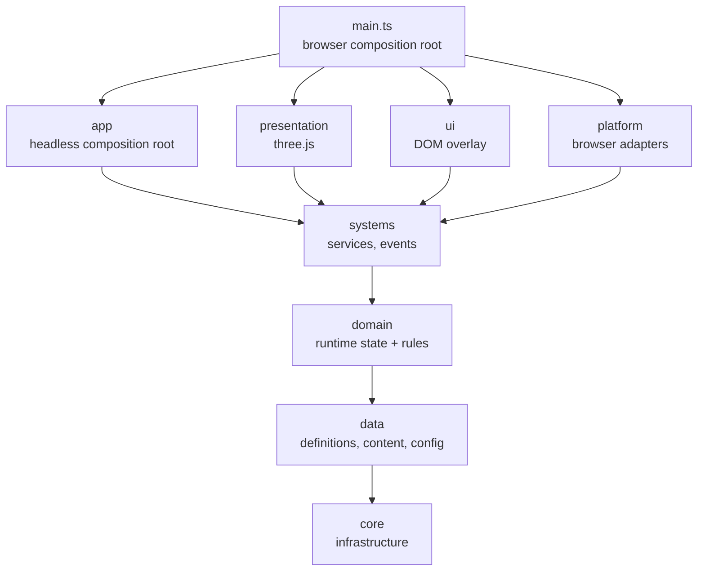

# RoadHaul Architecture

This document explains how the code is organised and why. The rules it describes are enforced by the type checker and by tests; `CLAUDE.md` has the short version.

## 1. Goals

- **Mobile first.** Runs in Android browsers today and in a Capacitor-wrapped app later, at 30 FPS or more on low/mid devices (spec §5).
- **Playable core before content** (spec §2.2). The code must grow by adding data, not by rewriting systems.
- **Game rules run without a browser.** They are unit-testable in Node and reusable on a server if the game goes online (spec §66).
- **Every change is verifiable** by typecheck, tests, build and a real-browser smoke test, in CI and in Claude Code sessions.

Stack: TypeScript, three.js (WebGL2), Vite, Vitest and Playwright ([ADR 0001](docs/adr/0001-web-stack-typescript-threejs.md)). Vehicle physics is our own deterministic model rather than a physics engine ([ADR 0002](docs/adr/0002-custom-vehicle-model.md)). Capacitor (Android packaging) arrives later.

## 2. Layers

The spec's principle is **Data -> Domain -> Systems -> Presentation -> UI**. Each layer only depends on the layers before it:



| Layer | Folder | Holds | May import | Runs on |
|---|---|---|---|---|
| core | `src/core` | Engine-agnostic infrastructure: service container, event bus, logging, clock, game loop, validation, `Result` | nothing | anywhere |
| data | `src/data` | Static definitions (the spec's ScriptableObjects), built-in content, central config | core | anywhere |
| domain | `src/domain` | Runtime state and pure rules: truck dynamics, road geometry and guidance, surfaces and collisions, mission rules (bays, stages, cargo damage, pay, XP), the wallet and costs, fuel and damage formulas, company levels, save data with migrations and validation, company name rules | core, data | anywhere |
| systems | `src/systems` | Services that own runtime state, apply domain rules and publish `GameEvents` (game state, driving, missions, economy, fuel, damage, company, saves, the game session) | core, data, domain | anywhere |
| app | `src/app` | Headless composition root: `GameBootstrapper`, `ServiceKeys` | core … systems | anywhere |
| presentation | `src/presentation` | three.js renderer, environment, track, depot and truck views, cameras, visual effects | core … systems, `three` | browser |
| ui | `src/ui` | DOM overlay: main menu, company HQ job board, mission HUD, touch driving controls, pause and result screens, string tables, debug overlay, styles | core … systems | browser |
| platform | `src/platform` | Browser/device adapters: frame scheduler, keyboard input, URL flags, fatal error screen, localStorage | core … systems | browser |
| entry | `src/main.ts` | Browser composition root | everything | browser |

"Anywhere" means browser, Node (tests) or a future server.

### Enforcement

1. **`tsconfig.pure.json`** compiles `core`, `data`, `domain`, `systems` and `app` with only the ES2022 library and no DOM or Node typings. Using `window`, `document`, `console`, `setTimeout` or `performance` there is a compile error.
2. **`tests/architecture/layering.test.ts`** scans the imports of every source file in `src/`. That covers static, type-only, re-export, dynamic and `import.meta.glob` imports, in `.ts`, `.mts`, `.cts` and `.tsx` files. The test fails when a layer imports a layer or npm package it may not use; it is what keeps three.js out of the pure layers. This is the spec §55 dependency rule turned into a test. The scanner itself is tested in `tests/architecture/importSpecifiers.test.ts`.

## 3. Core rules

- **UI and presentation never change game state directly** (spec §7). They call a system method, for example `economyService.addMoney(reward)`, never `money += 5000`, and they observe `GameEvents` to redraw.
- **Definitions are immutable, runtime state is separate** (spec §54). `ContentCatalog` deep-freezes every definition. Runtime state lives in the domain/systems layers and stores definition ids, never definition objects.
- **No global mutable state.** There are no singletons or module-level variables that change. Services are created in a composition root and passed as constructor parameters.
- **Inject the outside world.** Time (`Clock`), frame timing (`FrameScheduler`), logging (`Logger`) and later storage and randomness are interfaces, so rules are deterministic under test.
- **Expected failures vs bugs.** Invalid player input returns a `Result` (see `validateCompanyName`). Broken invariants throw (see `GameStateService.transitionTo`).

## 4. Boot sequence

1. `src/main.ts` reads URL flags (`?debug`, `?log=`) into the config and creates a `ConsoleLogger`.
2. `GameBootstrapper.boot()`:
   1. registers `Logger` and `Clock`;
   2. validates the content and builds the `ContentCatalog` (all problems are reported together);
   3. validates the config against the content (for example, that the starting truck exists);
   4. creates the `EventBus` and the services in dependency order: game state, driving, economy, company, missions, damage, fuel, saves and the game session (which subscribes last, so it saves state the others have already updated);
   5. runs `initialize()` on every service in registration order;
   6. moves the game state from `booting` to `mainMenu`.
3. `src/main.ts` picks the language (`?lang=`, then the browser's), puts the starting truck at the start of the starting map, and creates the `RenderHost` (WebGL), `EnvironmentView`, `TrackView`, `DepotView`, `TruckView`, `CameraRig`, keyboard and touch input, the menus, the HUD and, with `?debug`, the performance overlay. It wires the game flow (section 8) and starts the `GameLoop`. The game waits in the main menu, which offers Continue (with a saved game) and New company.
4. `<html data-boot-state>` becomes `ready`. `data-game-state` follows every `GameStateChanged` event and `data-mission-state` every `MissionStateChanged`. The e2e tests wait for them.

Any failure shows the fatal error screen and sets `data-boot-state="error"`. A failed boot disposes every service it had already created.

## 5. Services and lifecycle

`ServiceContainer` (`src/core/services`) is a typed registry with an ordered lifecycle:

- `register(key, instance)` / `resolve(key)` with typed `ServiceKey`s (`src/app/ServiceKeys.ts`);
- `initializeAll()` calls `initialize()` (sync or async) in registration order;
- `disposeAll()` calls `dispose()` in reverse order, keeps going when one fails, and rethrows all failures together.

Only composition code (`src/app`, `src/main.ts`) calls `resolve`. Everything else gets its dependencies through its constructor. The container is not a service locator.

**Adding a service:** write the class with constructor dependencies, register it in `GameBootstrapper.boot()` after its dependencies, add its key to `ServiceKeys`, and list it in `SYSTEM_MAP.md`.

## 6. Events

`EventBus<GameEvents>` (`src/core/events`) is a synchronous, typed publish/subscribe channel (spec §57). All cross-system events are declared in one map, `src/systems/GameEvents.ts`. Today it holds:

- game flow and driving: `GameStateChanged`, `VehicleCollided`;
- missions: `MissionStateChanged`, `CargoDamaged`, `MissionCompleted`, `MissionFailed`;
- money and the truck: `MoneyChanged`, `FuelChanged`, `VehicleDamaged`, `VehicleRepaired`;
- the company: `CompanyProgressed`, `CompanyLevelUp`.

Events join as their systems arrive.

- Systems emit. Presentation and UI subscribe.
- Events emitted by a handler are queued and delivered right after the current event, so every handler sees events in the order they happened. Otherwise delivery is synchronous.
- Unsubscribing takes effect immediately, even for the event being delivered. A disposed view never receives another event.
- `emit` does not allocate, except when it queues an event raised by a handler.
- A throwing handler is logged and does not break delivery to the others.

## 7. Game loop and time

`GameLoop` (`src/core/time`) is driven by a `FrameScheduler`, which is `requestAnimationFrame` in the browser and a fake in tests:

- `fixedUpdate(step)` runs at a fixed **60 Hz** (`FixedTimestep`), 0 to 5 times per frame. Physics and game rules go here, so they behave the same at any frame rate.
- `frameUpdate(delta, alpha)` runs once per frame. Animation and rendering go here. `alpha` interpolates visuals between fixed steps.
- Frames longer than 0.25 s (tab switches, hitches) are clamped. At most 5 catch-up steps run per frame, so a slow phone slows the simulation down instead of spiralling.
- The browser stops animation frames in background tabs, so the game pauses automatically.
- A handler that throws stops the loop and shows the fatal error screen.

The values live in `GameConfig.simulation`.

## 8. Driving and the mission loop

### Driving

Driving runs through the layers like everything else (roadmap steps 04–08):

```text
keyboard (platform/input) ─┐
                           ├─ combineVehicleInputs ─► DrivingService.step(dt, input)   [fixedUpdate, 60 Hz]
touch controls (ui) ───────┘                              │
                                        VehicleDynamics ──┤  domain: speed, gear, steering, position
                                        DrivingWorld ─────┘  domain: surface under the truck, collisions
                                                          │
                     TruckView, CameraRig ◄── interpolated pose (previous → current, alpha)   [frameUpdate]
```

- **`VehicleDynamics`** (`src/domain/vehicles`) is a deterministic kinematic bicycle model referenced at the rear axle ([ADR 0002](docs/adr/0002-custom-vehicle-model.md)). Its drivetrain has:
  - a torque/power curve and an automatic gearbox (it cannot hunt between gears);
  - a speed governor;
  - drag, rolling resistance and engine braking;
  - grip-limited traction and braking;
  - brake-to-reverse: hold the brake at a standstill to reverse;
  - understeer at the truck's cornering limit.

  All of it is data in `VehicleDefinition`. `vehicleTuning.test.ts` keeps the shipped trucks feeling like trucks.
- **`DrivingWorld`** (`src/domain/world`) is built from a `MapDefinition`:
  - road centrelines, sampled from a Catmull-Rom curve (`RoadPath`);
  - asphalt (roads and depot yards) or grass under the truck;
  - trees scattered from a seed, kept clear of roads, yards and buildings;
  - buildings and the map edge.

  Collisions correct the position per contact, then respond once per step to the hardest contact. A head-on hit stops the truck. A glancing one (under 20°) turns it along the obstacle, so it slides on with the speed it had along the surface instead of sticking. Angles up to 45° blend the two.
- **`DrivingService`** (`src/systems/driving`) owns the truck being driven. It emits one `VehicleCollided` per crash: impacts of 1.5 m/s or more into an obstacle, not repeated while the truck stays in contact. It also sets the cargo mass (a loaded truck is slower), parks the truck at a pose, and recovers a stuck truck onto the nearest road. Presentation reads its state and never writes it.
- **Input** is device-independent (`VehicleInput`). Keyboard (arrows/WASD, Space, C) and touch controls (steering wheel, gas, brake, camera button) are merged every fixed step.

### The mission loop

Roadmap steps 09–13 turn driving into a job (spec §9, §12, §50):

```text
main menu ─► company HQ (job board) ─► accept ─► drive to the pickup depot ─► stop in the bay: load
                    ▲                                                                 │
                    └── result (pay, or why it failed) ◄── stop in the bay: unload ◄──┘ drive to the delivery depot
```

- **Data.** Each city has a depot (`DepotDefinition` in the map): a paved yard beside the road with a loading bay. Cargo names the truck body it needs (`BodyType`: box, refrigerated, flatbed). Content validation checks that every mission's cities have depots and that some truck can haul it.
- **Domain** (`src/domain/missions`):
  - `loadingBay`: the whole truck must stand inside the bay, either way round, below about 1 km/h;
  - `MissionInstance`: the plain, saveable state of an accepted contract, with the stages accepted → travellingToPickup → loaded → delivering → completed or failed (abandoned, or cargo damaged beyond the client's tolerance);
  - `cargoDamage`: each crash damages the cargo with the square of its speed, scaled by the cargo's sensitivity;
  - `missionReward`: base pay (reward × cargo multiplier), an on-time bonus, a late penalty capped at half the base pay (spec §64), and a condition bonus for careful driving.
  - `world/roadRoute` gives the remaining distance by road and a point to steer toward, until the navigation graph of step 23.
- **`MissionService`** (`src/systems/missions`) offers the contracts the truck can haul (the job board), accepts one at a time, and advances it every fixed step after `DrivingService.step()`: loading after `GameConfig.missions.loadingSeconds` in the pickup bay (the truck gets the cargo's weight), the delivery clock, cargo damage from `VehicleCollided`, and unloading and the reward at the destination. It publishes `MissionStateChanged`, `CargoDamaged`, `MissionCompleted` and `MissionFailed` and never touches the UI.
- **Presentation and UI.** `DepotView` draws the yards and bay lines and lights a beacon over the next bay. The UI (`src/ui/menus`, `hq`, `hud`) shows the main menu, the job board, the mission HUD, the pause menu and the result, and only calls service methods. The simulation stands still while a menu or result is open, and the truck stays parked where it was left between contracts.
- **Text.** Player-facing text comes from string tables (`src/ui/i18n`, Turkish and English) with keys derived from ids (`mission.first_package.title`). A unit test keeps both languages complete.

### Economy, the truck's upkeep and the company

Roadmap steps 14–17 give deliveries consequences (spec §13–18):

- **`EconomyService`** is the only owner of money. It pays each delivery's reward (`MissionCompleted`), spends through a `Result` (not enough credits is an expected outcome) and announces `MoneyChanged`. Prices live in `GameConfig.economy`.
- **`FuelService`** burns fuel every fixed step for the distance driven:
  - the formula is spec §17's `fuelUsedLiters`: distance × base consumption × load × terrain × speed × condition;
  - `fuel.consumptionScale` makes up for the miniature map;
  - an empty tank stalls the engine;
  - refuelling costs money at the pump (the HQ) or, dearer, from a fuel truck on the road;
  - a stranded company that cannot pay gets a little emergency fuel for free, so it can never get stuck.
- **`DamageService`** turns collisions into truck damage in the spec §18 bands. Damage weakens the engine and brakes through `DrivingService.setPerformanceModifier` (upgrades will add their own modifiers), never to nothing. Repairs cost money.
- **`CompanyService`** keeps the company's name, XP, the five levels (`GameConfig.company.levelXp`), reputation and statistics. Deliveries add XP and reputation (computed with the reward in `missionProgress.ts`); failures cost reputation. Contracts can require a company level, and the job board shows what unlocks them.

## 9. Data and content

The spec's ScriptableObjects become **definition interfaces** (`src/data/definitions`) plus **content** (`src/data/content`):

- Vehicle (with physics data), map (with depots), cargo, city and mission definitions. Each definition file also exports its validation function.
- `GAME_CONTENT` (`src/data/content/index.ts`) is the built-in content set. `ContentCatalog.create()` validates every field and every cross-reference, then serves frozen lookups (`catalog.vehicles.get(id)`).
- References are checked at boot: missions must point to existing cities and cargo, origin and destination must differ, both cities need a depot, and some truck must have the body and payload for the load. Depots must name known cities. The config's starting truck and map must exist. Checks that need geometry, such as the spawn being on the road or every yard opening onto it, are content tests (`tests/unit/data/content`).
- **Ids** are `snake_case` and never change once shipped, because saves store them. **Units** are part of field names (`timeLimitSeconds`, `fuelCapacityLiters`). Money is integer `Credits`. Ratios are `Fraction`s from 0 to 1.
- Player-facing text is not stored in definitions. The string tables derive keys from ids, e.g. `cargo.packaged_food.name`.
- Content packs (spec §79) will be JSON with the same shape, loaded through the same validation.

Central tuning values (fixed step, pixel-ratio cap, loading time, prices, fuel scale, company levels, starting credits) live in `GameConfig` (`src/data/config`). The config is validated at boot, including against the content (a contract cannot require a level that does not exist).

## 10. Save data

`SaveGameData` (`src/domain/save`) is the root of the persisted state (spec §32). It is plain JSON with no classes, Maps or Dates. It holds:

- version and timestamps;
- profile, company, economy and garage;
- since v2: the world (where the truck is parked), the contract under way, and statistics.

`createNewSaveGameData()` builds the state for a new company.

- `CURRENT_SAVE_VERSION` (2) is stamped into every save. **Any schema change bumps it and adds a migration to `SAVE_MIGRATIONS` with a test.** `migrateSave` runs the chain from any older version and refuses saves from a newer build.
- `validateSaveGameData` checks every field, range and reference to content before a loaded save is trusted. An invalid save counts as corrupted and is never half-loaded.
- Trucks have instance ids (`truck_001`) separate from their model id (`rh_h1`), so the fleet can own two trucks of the same model later.
- **`SaveService`** (`src/systems/save`) writes JSON to a `KeyValueStorage`: localStorage in the browser (`platform/browser/browserStorage.ts`), memory in tests or when the browser forbids storage.
  - **Atomic write:** the new save goes to a pending slot and is read back; only then does the previous save move to the backup slot and the new one into the main slot.
  - **Backup:** loading falls back to it when the latest save is unreadable.
  - **Corruption:** unreadable data is set aside and reported.
  - **Storage errors** (a full quota, private mode) come back as Results: the game never crashes because of a save.
- **`GameSessionService`** (`src/systems/session`) is the company being played.
  - It starts a new game or continues the saved one, and hands each part of the save to the service that owns it (economy, company, fuel, damage, missions, the truck's position).
  - It saves after every delivery, failure and purchase, when the player leaves the road for a menu, and every 20 s of driving. The browser entry also saves when the tab hides or closes.

## 11. Rendering and the mobile performance budget

- `RenderHost` owns the `WebGLRenderer`, the scene and the camera. Views add objects to the scene and dispose everything they create. It uses filmic (ACES) tone mapping.
- **Look:** stylised low-poly with textures.
  - `EnvironmentView` draws a gradient sky dome with a sun glow, clouds and a ring of hazy hills. They all follow the camera. It also owns the fog and the sun and sky lights (`world/lighting.ts`).
  - `TrackView` draws textured grass, asphalt with gravel shoulders, two tree species, buildings with facades, and soft shadow decals.
  - `DepotView` draws concrete yards and bay lines, and the beacon over the bay the mission needs next.
  - `TruckView` builds a detailed cab-over truck carrying the RoadHaul livery.
- **Procedural textures, no image files** (`presentation/textures`). Grass, asphalt, facades, livery, rims and shadows are drawn in plain TypeScript: tileable noise and a small stroke font. They cost nothing to download and are original by construction. The same code runs in Node, so it is unit-tested.
- **Defaults for low/mid Android:**
  - pixel ratio capped at 1.5, MSAA off;
  - Lambert or Phong materials;
  - no real-time shadows (shadows are soft decals);
  - fog to hide the far plane.
- **Pre-lit flat surfaces.** The ground and road always face up under a fixed sun. They are unlit materials tinted with exactly what Lambert shading would give them (`flatGroundLight()`), so the pixels that cover most of the screen skip lighting.
- **Software rendering** (no GPU: headless CI browsers, some virtual machines) is detected from the WebGL renderer name. The host then renders at one pixel per CSS pixel without anisotropic filtering, so the simulation still runs in real time.
- **Budgets to validate on a real device (step 29):** at most ~150 draw calls and ~300k triangles in view, a 30 FPS floor. Use `InstancedMesh` for repeated objects (lane markings, trees, traffic) and merged geometry for static scenery. At the spawn point the test track, depots, beacon and truck cost about 35 draw calls and 60k triangles, as the `?debug` overlay shows.
- **Bundle:** three.js ships in its own chunk (about 540 kB, 135 kB gzipped), so it stays cached across game updates; the game code is about 100 kB.
- **Per-frame code must not allocate.** Keep scratch vectors and matrices as fields.
- The `?debug` overlay shows FPS, draw calls, triangles and the effective pixel ratio, plus the truck's position and heading (for placing things on maps; the e2e tests read the heading to check steering).

## 12. Testing

| Kind | Where | Runs | Covers |
|---|---|---|---|
| Unit (spec: EditMode) | `tests/unit/**` mirroring `src/` | `npm test` (Vitest, Node) | every rule, service and formula in the engine-agnostic layers, plus presentation code that runs without WebGL (such as resource disposal) |
| Architecture | `tests/architecture` | `npm test` | layer and package import rules, and the import scanner that checks them |
| End-to-end (spec: PlayMode) | `tests/e2e` | `npm run build && npm run test:e2e` (Playwright) | on an emulated Pixel 7 with SwiftShader WebGL: boot into the menu, the job board, a whole delivery (with the `?debug` T key), abandoning, pausing, keyboard and touch driving, reverse, camera switch, layout in both orientations, no console errors |

Test helpers live in `tests/support`: `MemoryLogger`, the content fixtures, the driving loop helpers and the three.js resource helpers. CI (`.github/workflows/ci.yml`) runs typecheck, unit tests, build and e2e on every pull request.

## 13. Folder layout

```text
src/
  core/            events/ logging/ math/ objects/ random/ services/ storage/ time/ validation/ Result.ts
  data/            config/ content/ definitions/ ContentCatalog.ts GameContent.ts units.ts
  domain/          company/ economy/ missions/ save/ vehicles/ world/
  systems/         company/ driving/ economy/ gameState/ missions/ save/ session/ vehicles/ GameEvents.ts
  app/             GameBootstrapper.ts ServiceKeys.ts
  presentation/    RenderHost.ts cameras/ textures/ vehicles/ world/ (later: effects/)
  ui/              controls/ debug/ hq/ hud/ i18n/ menus/ dom.ts styles.css
  platform/        browser/ input/
  main.ts
tests/
  unit/ architecture/ e2e/ support/
docs/
  ROADHAUL_Game_Design_Technical_Spec.md  adr/
```

Feature folders are created inside a layer when the feature arrives (`src/domain/missions`, `src/systems/missions`, ...). The layer folder decides what code may depend on.

## 14. Extension points

- **Online / server-authoritative (V4+, spec §66–67).** The engine-agnostic layers can run in Node. Rewards and economy changes already go through services, so a server can validate them later.
- **Ads and IAP (spec §35–36).** These become interfaces in systems (for example `AdService`) with platform implementations. Gameplay code never talks to an SDK.
- **Content packs and DLC (spec §79).** These are JSON with the `GameContent` shape, validated by the same catalog code.
- **Localization.** Turkish and English string tables keyed by definition ids (`src/ui/i18n`). No text is stored in definitions; more languages are more tables.
- **Multiplayer (V5+).** It is not part of V1. Keep new state serialisable and change it only through service methods, so it can be synchronised later.
